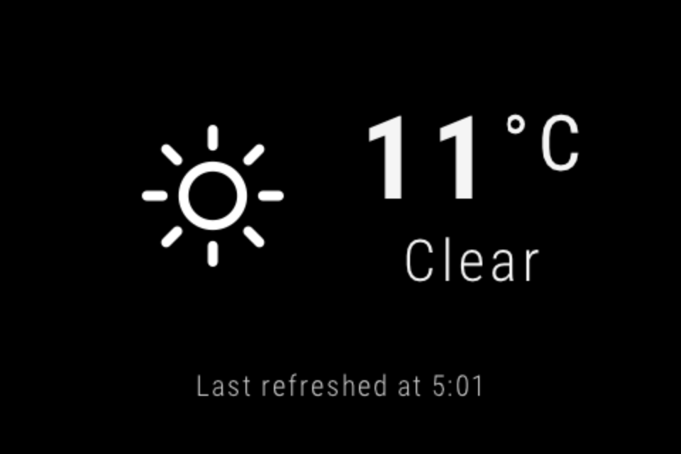

Table-top Heads-Up Display (HUD)
================================

A small Heads-Up Display (HUD) to show some useful information at a glance, like the current time and weather. Designed for a small LCD screen attached to a Raspberry Pi that I have running at home. Some design principles I've followed:

- Fits on a 480×320 pixel screen.
- Easy to see the basic information from far away, meaning not too much information on a single screen.
- Not too many separate screens, as that prevents useful information from being visible more often.



For more information about the development process, see the following blog posts:

1. [Setting up an LCD screen on the Raspberry Pi, 2019 edition](https://avikdas.com/2018/12/31/setting-up-lcd-screen-on-raspberry-pi.html)
1. [Writing GUI applications on the Raspberry Pi without a desktop environment](https://avikdas.com/2019/01/23/writing-gui-applications-on-raspberry-pi-without-x.html)
1. [Creating Raspberry Pi applications with Raylib and Ruby](https://avikdas.com/2019/02/19/creating-raspberry-pi-applications-with-raylib-and-ruby.html)
1. [Creating Raspberry Pi applications with Raylib and Ruby - Part II](https://avikdas.com/2019/03/04/creating-raspberry-pi-applications-with-raylib-and-ruby-part-2.html)

Despite running primarily on a Raspberry Pi, nothing about this project is specific to the platform.

Quick Start
-----------

1. Install [Raylib](https://www.raylib.com/). Build a shared library, instead of the default static library:

    ```sh
    cd /path/to/raylib
    cd src

    make RAYLIB_LIBTYPE=SHARED
    ```

1. Install development dependencies. On Debian-based systems:

    ```sh
    sudo apt install build-essential swig
    ```

1. Ensure you have a suitably new version of Ruby (3.x), along with its development headers needed to build native extensions. If you're using the system-wide Ruby installation on Debian-based systems:

    ```sh
    sudo apt install ruby ruby-dev
    ```

    I prefer using [rbenv](https://github.com/rbenv/rbenv) and [ruby-build](https://github.com/rbenv/ruby-build) to manage my Ruby installations. This allows me to have multiple installations on the same system.

1. Build the Ruby extension:

    ```sh
    # Install rake
    gem install bundler
    bundle

    # If Raylib is installed to standard location (with include + lib
    # subdirectories). Defaults to `/usr/local` if installed system-wide.
    bundle exec rake raylib RAYLIB_INSTALL_PATH=/path/to/raylib

    # If Raylib is installed to non-standard locations
    bundle exec rake raylib \
        RAYLIB_HEADER_INSTALL_PATH=/path/to/raylib/header \
        RAYLIB_LIB_INSTALL_PATH=/path/to/raylib/lib

    # If compiling on the Raspberry Pi, pass the `PLATFORM` flag. This flag
    # can be combined with the other flags from above.
    bundle exec rake raylib PLATFORM=PLATFORM_RPI
    ```

1. Register for the [OpenWeatherMap API](https://openweathermap.org/api) and obtain an App ID.

1. Run the HUD Ruby application, specifying the App ID as an environment variable:

    ```sh
    OPEN_WEATHER_APPID='<app-id-from-above>' ./hud.rb
    ```

Clean up
--------

The intermediate files generated during the building of the extension can be cleaned up:

```sh
# To clean up all intermediate files, but leave the final extension library:
#
#   rake clean
#
# To clean up all build artifacts, including the final extension library:
#
#   rake clobber
```

Packaged Dependencies
---------------------

### Open Weather Icons

- [Homepage](https://github.com/isneezy/open-weather-icons)
- Rendered as fixed-size white PNGs
- Open Weather Icon is licenced under MIT
- Icons from [Flaticon](https://www.flaticon.com) are under [CC](http://creativecommons.org/licenses/by/3.0/): [Lucy G](http://www.flaticon.com/authors/lucy-g), [Freepik](http://www.freepik.com), [SimpleIcon](http://www.flaticon.com/authors/simpleicon), [Robin Kylander](http://www.flaticon.com/authors/robin-kylander), [Darius Dan](http://www.flaticon.com/authors/darius-dan), [AnhGreen](http://www.flaticon.com/authors/anhgreen)

### Roboto Condensed Font

- [Homepage](https://fonts.google.com/specimen/Roboto+Condensed?selection.family=Roboto+Condensed)
- Licensed under the [Apache License, version 2.0](http://www.apache.org/licenses/LICENSE-2.0)
